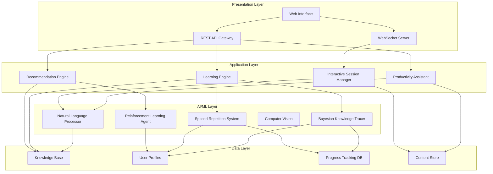

# Design Document: AI Learning Assistant

## Overview

The AI Learning Assistant is a comprehensive system that leverages artificial intelligence to accelerate learning, enhance productivity, and improve technology comprehension. The system implements a three-tier architecture with real-time personalization capabilities, adaptive content delivery, and intelligent knowledge retention mechanisms.

The design follows modern AI-powered learning platform patterns, incorporating [Bayesian Knowledge Tracing](https://www.computer.org/publications/tech-news/trends/personalized-learning-revolution), [spaced repetition algorithms](https://mindstamp.com/blog/knowledge-retention-strategies), and contextual productivity assistance. Research shows that personalized learning can improve outcomes by up to 30% compared to traditional methods, while [spaced repetition can boost retention by 150%](https://www.arist.co/post/60-day-spaced-repetition-schedule-compliance-training-retention/blogrelixir).

## Architecture

The system implements a microservices architecture with the following core layers:



### Data Ingestion Layer
High-performance event capture system processing 300-500 events per user hour, including:
- Learning interactions (quiz responses, content engagement)
- Behavioral signals (dwell time, click patterns, navigation paths)
- Performance metrics (completion rates, error patterns)
- Contextual data (time of day, device type, environment)

### Analytics Engine
Multi-model ML pipeline implementing:
- **Bayesian Knowledge Tracing**: Maps cognitive domains and prerequisite relationships
- **Gradient Boosting Trees**: Handle next-action recommendations
- **LSTM Networks**: Recognize temporal learning patterns and predict optimal intervention timing
- **Collaborative Filtering**: Content recommendation using matrix factorization
- **Reinforcement Learning**: Adaptive intervention system for personalized assistance

### Adaptive Intervention System
Hybrid rule-based and RL-driven system that determines when and how to provide assistance, maintaining a computational graph of knowledge components with weighted prerequisite relationships.

## Components and Interfaces

### Learning Engine
**Purpose**: Core AI system managing personalized learning paths and adaptive content delivery

**Key Responsibilities**:
- Generate and maintain personalized learning paths based on skill assessments
- Adapt content difficulty and presentation based on user performance
- Coordinate with other components for holistic learning experience

**Interfaces**:
```typescript
interface LearningEngine {
  generateLearningPath(userId: string, goals: LearningGoal[]): Promise<LearningPath>
  adaptPath(userId: string, performance: PerformanceData): Promise<LearningPath>
  assessSkillLevel(userId: string, domain: string): Promise<SkillAssessment>
  recommendNextActivity(userId: string): Promise<LearningActivity>
}

interface LearningPath {
  id: string
  userId: string
  goals: LearningGoal[]
  activities: LearningActivity[]
  prerequisites: PrerequisiteMap
  estimatedDuration: number
  adaptationHistory: AdaptationEvent[]
}
```

### Productivity Assistant
**Purpose**: Contextual AI assistance for work efficiency and decision-making

**Key Responsibilities**:
- Analyze work context and suggest relevant tools/shortcuts
- Provide diagnostic assistance for technical problems
- Identify automation opportunities in workflows
- Recommend practical projects for skill reinforcement

**Interfaces**:
```typescript
interface ProductivityAssistant {
  analyzeContext(workContext: WorkContext): Promise<ContextualSuggestion[]>
  diagnoseIssue(problem: ProblemDescription): Promise<DiagnosticResult>
  identifyAutomation(workflow: WorkflowData): Promise<AutomationOpportunity[]>
  prioritizeTasks(tasks: Task[], constraints: Constraint[]): Promise<PrioritizedTaskList>
}

interface ContextualSuggestion {
  type: 'tool' | 'shortcut' | 'best-practice' | 'resource'
  title: string
  description: string
  relevanceScore: number
  actionable: boolean
}
```

### Knowledge Retention System
**Purpose**: Implement spaced repetition and memory reinforcement algorithms

**Key Responsibilities**:
- Schedule optimal review times using spaced repetition algorithms
- Adapt review frequency based on individual retention patterns
- Connect new learning to previously mastered concepts
- Present varied review formats for memory consolidation

**Interfaces**:
```typescript
interface KnowledgeRetentionSystem {
  scheduleReview(concept: Concept, userRetention: RetentionProfile): Promise<ReviewSchedule>
  updateRetentionModel(userId: string, reviewResult: ReviewResult): Promise<void>
  generateReviewSession(userId: string): Promise<ReviewSession>
  connectConcepts(newConcept: Concept, existingKnowledge: Concept[]): Promise<ConceptMap>
}

interface ReviewSchedule {
  conceptId: string
  nextReviewDate: Date
  interval: number // in days
  difficulty: number
  retentionProbability: number
}
```

### Progress Tracker
**Purpose**: Monitor learning progress and generate analytics insights

**Key Responsibilities**:
- Continuously monitor user interactions and learning activities
- Build comprehensive competency profiles
- Identify learning patterns and optimization opportunities
- Generate progress reports and alerts

**Interfaces**:
```typescript
interface ProgressTracker {
  recordActivity(userId: string, activity: LearningActivity, result: ActivityResult): Promise<void>
  getCompetencyProfile(userId: string): Promise<CompetencyProfile>
  generateProgressReport(userId: string, timeframe: TimeRange): Promise<ProgressReport>
  identifyLearningPatterns(userId: string): Promise<LearningPattern[]>
}

interface CompetencyProfile {
  userId: string
  domains: Map<string, SkillLevel>
  learningVelocity: number
  retentionRate: number
  preferredModalities: LearningModality[]
  lastUpdated: Date
}
```

### Interactive Session Manager
**Purpose**: Orchestrate real-time AI-guided learning sessions

**Key Responsibilities**:
- Provide contextual guidance during learning sessions
- Adapt explanations based on user understanding
- Maintain session state and learning context
- Coordinate with other components for seamless experience

**Interfaces**:
```typescript
interface InteractiveSessionManager {
  startSession(userId: string, activity: LearningActivity): Promise<InteractiveSession>
  processUserInput(sessionId: string, input: UserInput): Promise<AIResponse>
  adaptExplanation(sessionId: string, comprehensionLevel: number): Promise<AdaptedContent>
  endSession(sessionId: string): Promise<SessionSummary>
}

interface InteractiveSession {
  id: string
  userId: string
  activity: LearningActivity
  currentState: SessionState
  conversationHistory: Interaction[]
  adaptationLevel: number
}
```

## Data Models

### User Profile
```typescript
interface UserProfile {
  id: string
  personalInfo: {
    name: string
    email: string
    timezone: string
    preferredLanguage: string
  }
  learningPreferences: {
    modalities: LearningModality[]
    pacePreference: 'slow' | 'moderate' | 'fast'
    difficultyTolerance: number
    sessionDuration: number
    availableTimeSlots: TimeSlot[]
  }
  competencyProfile: CompetencyProfile
  goals: LearningGoal[]
  retentionProfile: RetentionProfile
  collaborationPreferences: CollaborationSettings
}

interface LearningGoal {
  id: string
  title: string
  description: string
  targetCompetencyLevel: SkillLevel
  deadline?: Date
  priority: 'low' | 'medium' | 'high'
  progress: number // 0-100
}
```

### Knowledge Graph
```typescript
interface KnowledgeGraph {
  concepts: Map<string, Concept>
  relationships: ConceptRelationship[]
  domains: TechnologyDomain[]
  prerequisites: PrerequisiteMap
}

interface Concept {
  id: string
  title: string
  description: string
  domain: string
  difficulty: number
  prerequisites: string[]
  relatedConcepts: string[]
  contentModules: ContentModule[]
  assessmentCriteria: AssessmentCriterion[]
}

interface ConceptRelationship {
  fromConcept: string
  toConcept: string
  type: 'prerequisite' | 'related' | 'builds-upon' | 'alternative'
  strength: number // 0-1
}
```

### Learning Content
```typescript
interface ContentModule {
  id: string
  conceptId: string
  type: 'text' | 'video' | 'interactive' | 'simulation' | 'assessment'
  title: string
  content: ContentData
  difficulty: number
  estimatedDuration: number
  modality: LearningModality
  accessibility: AccessibilityFeatures
  metadata: ContentMetadata
}

interface LearningActivity {
  id: string
  conceptId: string
  type: 'reading' | 'practice' | 'assessment' | 'project' | 'discussion'
  contentModules: ContentModule[]
  objectives: LearningObjective[]
  prerequisites: string[]
  estimatedDuration: number
  adaptationRules: AdaptationRule[]
}
```

### Progress and Analytics
```typescript
interface ProgressData {
  userId: string
  activityId: string
  startTime: Date
  endTime?: Date
  completionStatus: 'not-started' | 'in-progress' | 'completed' | 'abandoned'
  performanceMetrics: PerformanceMetric[]
  interactions: UserInteraction[]
  adaptations: AdaptationEvent[]
}

interface PerformanceMetric {
  type: 'accuracy' | 'speed' | 'engagement' | 'retention'
  value: number
  timestamp: Date
  context: string
}

interface RetentionProfile {
  userId: string
  conceptRetention: Map<string, RetentionData>
  forgettingCurve: ForgettingCurveModel
  optimalIntervals: Map<string, number>
  lastUpdated: Date
}
```

## Correctness Properties

*A property is a characteristic or behavior that should hold true across all valid executions of a system—essentially, a formal statement about what the system should do. Properties serve as the bridge between human-readable specifications and machine-verifiable correctness guarantees.*

Based on the prework analysis of acceptance criteria from the requirements document, the following correctness properties ensure the system behaves correctly across all valid inputs and scenarios:

### Property 1: Learning Path Personalization and Adaptation
*For any* user with a skill assessment and learning goals, the Learning_Engine should generate a learning path that matches their competency level, addresses their stated goals, adapts when progress indicates mastery or struggle, optimizes for their time constraints, and updates recommendations when preferences change.
**Validates: Requirements 1.1, 1.2, 1.3, 1.4, 1.5**

### Property 2: Interactive Session Contextual Guidance and Engagement
*For any* interactive learning session, the AI_Learning_Assistant should provide guidance tailored to the user's understanding level, answer questions contextually based on current lesson content, offer hints without complete solutions, adapt explanations when confusion is detected, and maintain engagement through varied delivery methods including visual, textual, and hands-on components.
**Validates: Requirements 2.1, 2.2, 2.3, 2.4, 2.5**

### Property 3: Productivity Context Analysis and Comprehensive Assistance
*For any* technical work context, the Productivity_Assistant should analyze the situation and provide relevant tool suggestions and shortcuts, diagnostic assistance for problems, automation opportunity identification, practical project recommendations for completed learning, and task prioritization based on goals and deadlines.
**Validates: Requirements 3.1, 3.2, 3.3, 3.4, 3.5**

### Property 4: Comprehensive Progress Monitoring and Analytics
*For any* user learning activity, the Progress_Tracker should continuously monitor all interactions and behaviors, update competency profiles across technology domains, provide immediate feedback on completion, identify learning patterns and suggest optimizations, detect stalls or regressions with alerts, and generate comprehensive progress reports when requested.
**Validates: Requirements 4.1, 4.2, 4.3, 4.4, 4.5, 4.6**

### Property 5: Spaced Repetition and Knowledge Retention Management
*For any* learned concept, the Knowledge_Retention_System should schedule reviews using spaced repetition algorithms optimized for retention, adapt frequency based on individual retention patterns and performance, prompt reviews after engagement gaps, present concepts in varied formats during reviews, and connect new concepts to previously mastered material.
**Validates: Requirements 5.1, 5.2, 5.3, 5.4, 5.5**

### Property 6: Adaptive Content Delivery and Universal Accessibility
*For any* user interaction pattern and learning preference, the Learning_Engine should identify preferred learning modalities through analysis, break content into segments fitting time constraints, prioritize content types and delivery methods based on preferences, ensure accessibility compliance including screen reader compatibility, and provide alternative formats for users with disabilities without compromising effectiveness.
**Validates: Requirements 6.1, 6.2, 6.3, 6.4, 6.5**

### Property 7: Layered Technology Understanding and Explanation
*For any* technical concept explanation request, the AI_Learning_Assistant should provide layered explanations starting with basic principles and allowing progression to advanced details, create visual representations and analogies for abstract concepts, connect new topics to existing user knowledge, provide real-world examples relevant to user context, and guide through underlying principles when deeper understanding is requested.
**Validates: Requirements 7.1, 7.2, 7.3, 7.4, 7.5**

### Property 8: Multi-Level User Competency Adaptation
*For any* user competency profile, the Learning_Engine should accurately assess skills across multiple technology domains independently, provide foundational support for beginners with guided practice, offer advanced challenges for experienced users with cutting-edge focus, allow manual difficulty adjustments when requested, and provide domain-specific challenge levels while maintaining coherent paths for mixed competencies.
**Validates: Requirements 8.1, 8.2, 8.3, 8.4, 8.5**

### Property 9: Collaborative Learning and Privacy Protection
*For any* collaborative learning scenario, the AI_Learning_Assistant should connect users with peers having complementary skills and compatible goals when opted in, provide group-appropriate guidance while maintaining individual learning paths, moderate interactions to ensure productive environments with intervention capabilities, recognize user contributions in competency profiles and achievements, and protect privacy while enabling meaningful collaboration.
**Validates: Requirements 9.1, 9.2, 9.3, 9.4, 9.5**

### Property 10: Seamless Integration and Multi-Platform Synchronization
*For any* external platform integration or multi-device usage, the AI_Learning_Assistant should connect through APIs and browser extensions without requiring workflow changes, offer contextual help within existing tools without disrupting primary tasks, synchronize all progress and preferences across platforms when users switch devices, incorporate existing learning materials into personalized paths with progress tracking, and export learning data in standard formats when portability is needed.
**Validates: Requirements 10.1, 10.2, 10.3, 10.4, 10.5**

## Error Handling

The system implements comprehensive error handling across all components:

### Learning Engine Error Handling
- **Invalid Skill Assessment Data**: Gracefully handle incomplete or inconsistent assessment results by requesting clarification or using default competency assumptions
- **Learning Path Generation Failures**: Implement fallback mechanisms using template learning paths when personalization algorithms fail
- **Adaptation Algorithm Errors**: Maintain current learning path state and log errors for analysis while continuing to serve content

### AI/ML Model Error Handling
- **Model Inference Failures**: Implement circuit breaker patterns with fallback to rule-based systems when ML models are unavailable
- **Training Data Inconsistencies**: Validate input data and implement data cleaning pipelines to handle corrupted or inconsistent training examples
- **Recommendation Engine Failures**: Fall back to popularity-based recommendations when collaborative filtering or content-based algorithms fail

### Data Layer Error Handling
- **Database Connection Failures**: Implement connection pooling with automatic retry mechanisms and read replica failover
- **Data Corruption**: Implement data validation at ingestion and regular integrity checks with automatic repair mechanisms
- **Synchronization Failures**: Queue failed synchronization operations for retry and maintain local state consistency

### Integration Error Handling
- **External API Failures**: Implement exponential backoff retry strategies and graceful degradation when external services are unavailable
- **Authentication/Authorization Errors**: Provide clear error messages and automatic token refresh mechanisms for expired credentials
- **Data Format Incompatibilities**: Implement flexible data transformation pipelines with validation and error reporting

### User Experience Error Handling
- **Session Timeout**: Automatically save progress and provide seamless session restoration
- **Network Connectivity Issues**: Implement offline mode with local caching and automatic synchronization when connectivity is restored
- **Invalid User Input**: Provide contextual error messages and suggestions for correction without losing user progress

## Testing Strategy

The AI Learning Assistant requires a comprehensive testing approach that combines traditional unit testing with property-based testing to ensure correctness across the complex AI-driven behaviors.

### Dual Testing Approach

**Unit Tests**: Focus on specific examples, edge cases, and integration points between components. Unit tests validate concrete scenarios and ensure individual components function correctly in isolation.

**Property-Based Tests**: Verify universal properties across all possible inputs using randomized test generation. Property tests ensure that the AI behaviors maintain correctness regardless of the specific user data, learning content, or interaction patterns.

Together, these approaches provide comprehensive coverage where unit tests catch concrete implementation bugs and property tests verify that the system maintains its behavioral guarantees across the full input space.

### Property-Based Testing Configuration

The system will use **Hypothesis** (Python) for property-based testing, configured with:
- **Minimum 100 iterations** per property test to ensure adequate randomization coverage
- **Custom generators** for learning data, user profiles, and interaction patterns
- **Shrinking strategies** to find minimal failing examples when properties are violated

Each property test must include a comment tag referencing its design document property:
**Feature: ai-learning-assistant, Property {number}: {property_text}**

### Unit Testing Focus Areas

Unit tests should concentrate on:
- **API endpoint validation** with specific request/response examples
- **Database integration** with known data sets and expected outcomes
- **External service integration** with mocked responses and error conditions
- **Edge cases** such as empty learning paths, invalid user inputs, and boundary conditions
- **Error handling scenarios** with specific failure modes and recovery expectations

### AI/ML Testing Considerations

- **Model validation** using held-out test datasets with known expected behaviors
- **Bias detection** through demographic parity and equalized odds testing
- **Performance regression testing** to ensure model updates don't degrade learning outcomes
- **A/B testing framework** for comparing different recommendation algorithms and learning strategies

### Integration Testing

- **End-to-end learning workflows** from user registration through course completion
- **Cross-component data flow** validation ensuring consistent state across services
- **Real-time interaction testing** for interactive sessions and collaborative features
- **Multi-device synchronization** testing across different platforms and devices

### Performance Testing

- **Load testing** for concurrent users and high-volume learning activity processing
- **Latency testing** for real-time AI responses and recommendation generation
- **Memory usage monitoring** for long-running learning sessions and large knowledge graphs
- **Scalability testing** for growing user bases and expanding content libraries

The testing strategy ensures that both the deterministic components (data management, API endpoints) and the AI-driven components (personalization, recommendations, adaptive content) maintain correctness and reliability across all usage scenarios.